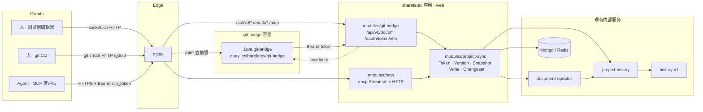

# Overleaf CE 内建 MCP 与 git-bridge 共存架构设计

- 基线：`overleaf/overleaf@28ad3b0`（fork：`Zack-Will/overleaf`）
- 状态：设计稿 v1
- 范围：在 Community Edition 上，不依赖 Server Pro 闭源模块，同时提供
  1. 与官方 Java git-bridge 完全兼容的 Git 集成
  2. 面向 AI agent 的内建 MCP（Model Context Protocol）端点

  两者共享同一套版本、鉴权与写入内核，改动出现在同一条历史时间线上。

---

## 1. 目标与非目标

### 目标

| # | 目标 | 验收方式 |
|---|---|---|
| G1 | `git clone http://git@<host>/git/<projectId>` 在 CE 上可用，使用 `olp_` 个人令牌 | 复用 `server-ce/test/git-bridge.spec.ts` 的断言 |
| G2 | `git push` 后编辑器实时更新，历史面板显示 `(via Git)` | 同上 |
| G3 | agent 通过 MCP 读写文件，写入带基线版本校验，冲突时一次往返可恢复 | MCP 集成测试 |
| G4 | agent 的多文件改动可作为一个事务提交，人可在历史里一键回退 | 历史面板出现单个带标签的版本 |
| G5 | agent 可以 fork 草稿项目、生成提案，人审阅后再合并到主项目 | 端到端测试 |
| G6 | 所有新代码集中在 `services/web/modules/` 下的独立目录，upstream 升级时 rebase 成本最小 | 代码评审 |

### 非目标

- 不实现完整 OAuth2 授权服务器（Server Pro 的 `modules/oauth2-server` 不在开源树中，我们只需满足 git-bridge 对 `/oauth/token/info` 的最小契约）。
- 不实现 track changes / 评论审阅流（Server Pro 功能），提案审阅以"草稿项目 + diff"实现。
- 不修改 Java git-bridge 源码，直接使用公开镜像 `quay.io/sharelatex/git-bridge`。

---

## 2. 现状：CE 里有什么、缺什么

调研基于本仓库源码，行号以 `28ad3b0` 为准。

### 2.1 已存在、可直接复用

| 能力 | 位置 | 说明 |
|---|---|---|
| Java git-bridge 完整源码与镜像 | `services/git-bridge/`，镜像 `quay.io/sharelatex/git-bridge` | MIT 许可，`server-ce/test/docker-compose.yml:59-68` 展示了官方接线方式 |
| web 模块加载机制 | `services/web/app/src/infrastructure/Modules.mjs:43-91` | 按 `Settings.moduleImportSequence` 加载 `modules/<name>/index.mjs` |
| 无 CSRF 路由挂点 | `services/web/app/src/infrastructure/Server.mjs:231` | `applyNonCsrfRouter` 在 CSRF 中间件之前执行，机器客户端端点必须走这里 |
| 项目级最新版本号 | project-history `GET /project/:id/version`（`services/project-history/app/js/Router.js:24`） | 返回 `{version, timestamp, v2Authors}` |
| 指定版本的全项目快照 | project-history `GET /project/:id/version/:version`（`Router.js:72`） | `SnapshotManager.js:115-116` 注释明写 "Used by git bridge to get the state of the project" |
| 命名版本（labels） | `HistoryManager.mjs` / project-history `Router.js:38-55` | 即 git-bridge 的 `saved_vers` |
| 外部写入合并器 | `services/web/app/src/Features/ThirdPartyDataStore/UpdateMerger.mjs:91` | `_mergeUpdate(userId, projectId, path, fsPath, source)`，注释 `// called by GitBridgeHandler` |
| 文档级设值 | `DocumentUpdaterHandler.mjs:117` `setDocument(projectId, docId, userId, docLines, source)` | document-updater 对新旧内容做 diff 生成 OT 操作，**并发的人工编辑不会被覆盖** |
| origin 透传到历史 | `services/project-history/app/js/UpdateTranslator.js:140-144` | `source` 传对象 `{kind:'git-bridge'}` 即成为 `change.origin`；前端 `origin.tsx:10` 已把 `git-bridge` 渲染为 "(via Git)" |
| 项目复制 | `services/web/app/src/Features/Project/ProjectDuplicator.mjs:37` | `duplicate(owner, projectId, name, tags, opts)` |
| 版本回退 | `RestoreManager.mjs`，路由 `HistoryRouter.mjs:82-92` | `revert_file` / `revert-project` |
| 权限判定 | `AuthorizationManager.mjs:260-334` | `canUserReadProject` / `canUserWriteProjectContent` 等，纯函数，不依赖 session |
| 项目锁 | `services/web/app/src/infrastructure/LockManager.mjs` | Redis 锁 |
| 前端挂点 | `settings.defaults.js:1029,1056,1101` | `overleafModuleImports.gitBridge / integrationLinkingWidgets / integrationPanelComponents` 均为空数组 |
| 功能开关 | `Features.mjs:66-67` | `Settings.enableGitBridge`，但 CE 从未赋值 |

### 2.2 缺失、需要新建

| 缺口 | 影响 |
|---|---|
| web 侧 `/api/v0/docs/*` 四个端点 | git-bridge 无法取版本、快照，无法推送 |
| `/oauth/token/info` | git-bridge 无法校验用户令牌 |
| 个人访问令牌（PAT）模型、生成与撤销 UI | 只有 `listPersonalAccessTokens` / `cleanupPersonalAccessTokens` 两个 hook 名和一个 settings 占位 |
| `enableGitBridge` / `gitBridgePublicBaseUrl` 赋值、nginx `/git/` 路由、compose 服务 | 功能开关永远关闭 |
| 编辑器里的 "Clone with Git" 模态框 | `integrationPanelComponents` 槽位为空 |
| 任何 compare-and-swap 写接口 | agent 写入没有基线校验 |
| MCP 相关代码 | 全仓库零引用 |

---

## 3. 总体架构



三个新模块，一个依赖方向：

```
modules/project-sync      核心库 + PAT + 设置页 UI      （无外部依赖）
modules/git-bridge        HTTP 适配器 + 编辑器模态框     dependencies: ['project-sync']
modules/mcp               MCP 适配器 + 草稿/提案        dependencies: ['project-sync']
```

拆成三个而不是一个的原因：运维可以只启用 git-bridge 而不暴露 MCP，反之亦然；`Modules.mjs:76-85` 会校验 `dependencies` 都在 `moduleImportSequence` 中，缺失时启动即失败，不会静默降级。

### 3.1 共存的关键约束

1. **单一真相源**：两条路径都不维护自己的项目内容副本。读一律经 project-history 快照，写一律经 `UpdateMerger` / `setDocument` 进入 document-updater。
2. **统一版本坐标**：`projectVersion`（project-history 的单调递增版本号）是唯一的项目级基线。git-bridge 的 `latestVerId` 就是它；MCP 的 `base_project_version` 也是它。
3. **来源可辨**：写入时 `source` 参数传对象，`{kind:'git-bridge'}` 或 `{kind:'mcp', agent, request_id, changeset}`。历史面板据此显示 "(via Git)" / "(via Agent)"。
4. **互相可见**：git push 产生的新版本，agent 下一次读到的 `projectVersion` 就变了；agent 写入产生的版本，`git pull` 作为一次新 commit 拉下来。两边都不需要感知对方存在。
5. **同一把锁**：`project-sync` 对每个项目维护一个写锁，git push 的应用阶段和 MCP 的 changeset 提交阶段互斥。锁只覆盖"应用改动"这一小段，不阻塞人工编辑。

---

## 4. 核心模块 `modules/project-sync`

目录：

```
services/web/modules/project-sync/
├── index.mjs                       # router + hooks 注册
├── app/src/
│   ├── PersonalAccessToken.mjs     # mongoose 模型
│   ├── TokenService.mjs            # 生成 / 校验 / 撤销
│   ├── TokenAuthMiddleware.mjs     # requireAccessToken(scope)
│   ├── VersionService.mjs          # flush + 取 projectVersion
│   ├── SnapshotService.mjs         # 指定版本快照、二进制签名 URL
│   ├── WriteService.mjs            # 文件集应用、文档 CAS、锁
│   ├── ChangesetService.mjs        # 暂存事务
│   ├── SignedUrl.mjs               # HMAC 短时签名
│   └── TokenController.mjs         # 设置页 REST
├── frontend/js/
│   └── linking-widgets/git-token-widget.tsx   # 注入 integrationLinkingWidgets 槽
└── test/{unit,acceptance}
```

### 4.1 个人访问令牌

模型 `personalAccessTokens`：

```js
{
  user_id: ObjectId,
  tokenPrefix: String,        // 前 8 位，用于列表展示 "olp_xxxx************"
  hashedToken: String,        // sha256(token)，唯一索引
  scopes: [String],           // 'git_bridge' | 'mcp'
  label: String,
  createdAt, expiresAt, lastUsedAt: Date
}
```

- 格式 `olp_` + 16 位 `[A-Za-z0-9]`，与 `git-bridge.spec.ts:84` 的正则 `/olp_[a-zA-Z0-9]{16}/` 一致。
- 校验走哈希查找，避免逐条 `timingSafeEqual`。
- 实现 `listPersonalAccessTokens(userId)` 与 `cleanupPersonalAccessTokens(userId)` 两个 hook，接入 `UserPagesController.mjs:75-79` 和 `UserDeleter.mjs:224-226` 已有的调用点。
- `requireAccessToken(scope)` 中间件接受两种携带方式：
  - `Authorization: Bearer <token>`（git-bridge 转发用户令牌的方式，`SnapshotAPIRequest.java:20-28`）
  - `Authorization: Basic base64("git:<token>")`（MCP 客户端或 curl 的便利写法）

  成功后设置 `req.syncUser = {userId, scopes, tokenId}`，不建 session。

### 4.2 版本服务

```js
async function getLatestVersion(projectId) {
  await DocumentUpdaterHandler.promises.flushProjectToMongo(projectId) // 把 redis 里的编辑推进历史队列
  await HistoryManager.promises.flushProject(projectId)                 // project-history 处理队列
  return projectHistory.get(`/project/${projectId}/version`)            // {version, timestamp, v2Authors}
}
```

两次 flush 是必要的：Cypress 用例里编辑器改动是靠"重新编译"触发 flush 才进入历史的（`git-bridge.spec.ts:391-402`），机器客户端没有这一步，必须自己做。

### 4.3 快照服务

`getSnapshot(projectId, version)` → project-history `GET /project/:id/version/:version`，返回 `{files: {path: {data:{content}} | {data:{hash}}}}`。

- 文本文件直接给内容。
- 二进制文件只有 blob hash。git-bridge 会用**不带任何鉴权头**的 GET 去取 `atts[].url`（`UrlResourceCache.java:75-99`），所以 URL 必须自鉴权。方案：由 web 提供 `GET /api/v0/docs/:id/blobs/:hash?token=<hmac>&_path=<path>`，token 为 `HMAC(secret, projectId|hash|expiry)`，有效期 10 分钟，内部再经 `HistoryManager.requestBlobWithProjectId` 流式转发。git-bridge 计算缓存键时会剥掉 `token=`（`UrlResourceCache.java:130-138`），与其注释里期待的 URL 形态一致。
- 大项目注意：history-v1 的 `latest/content` 会把整条历史加载进内存（`HistoryManager.mjs:231-235` 有警告）。我们用 project-history 的按版本快照接口，它走 chunk 缓存，代价可控；仍需对文件数和总字节设上限，超限时返回 `413` 并提示用 zip 下载。

### 4.4 写服务

两个入口，一把锁：

```js
// 文件集语义：git push 与 MCP write_file / changeset 都走这里
async function applyFileSet(projectId, userId, origin, {upserts, deletes}) {
  return LockManager.runWithLock(`sync:${projectId}`, async () => {
    for (const {path, fsPath} of upserts)
      await UpdateMerger.promises._mergeUpdate(userId, projectId, path, fsPath, origin)
    for (const path of deletes)
      await UpdateMerger.promises.deleteUpdate(userId, projectId, path, origin)
    return getLatestVersion(projectId)
  })
}

// 文档 CAS 语义：MCP apply_edits 用
async function writeDocCAS(projectId, docId, userId, origin, baseDocVersion, newLines) {
  return LockManager.runWithLock(`sync:${projectId}`, async () => {
    const {lines, version} = await DocumentUpdaterHandler.promises.getDocument(projectId, docId, -1)
    if (version !== baseDocVersion) throw new ConflictError({currentLines: lines, currentVersion: version})
    await DocumentUpdaterHandler.promises.setDocument(projectId, docId, userId, newLines, origin)
    return DocumentUpdaterHandler.promises.getDocument(projectId, docId, -1)
  })
}
```

要点：

- `_mergeUpdate` 自动判断 doc / file、自动建目录、自动触发实时事件，前端编辑器会实时刷新，无需额外广播。
- `setDocument` 在 document-updater 内部对新旧内容做 diff 并生成 OT 操作（`DocumentManager.js:182-213`），即便锁外有人正在打字，人的操作与 agent 的操作会被 OT 变换合并，而不是整段覆盖。CAS 校验解决的是"agent 基于过期内容做决策"的语义问题，OT 解决的是字符级冲突。
- `deleteUpdate` 目前会吞错误只打 warn（`UpdateMerger.mjs:137-142`），我们的封装要把失败显式收集后返回给调用方。
- `origin` 对象会原样进入 `change.origin`，前端历史组件据 `kind` 渲染标签。

### 4.5 变更集（changeset）

Redis 存储，TTL 1 小时：

```
sync:changeset:<id> = {
  projectId, userId, baseProjectVersion, message,
  edits: [ {type:'upsert_doc', path, lines} | {type:'upsert_file', path, blobRef} | {type:'delete', path} ],
  status: 'open' | 'committed' | 'aborted'
}
```

`commit` 时：校验 `baseProjectVersion` 未变（可选 `force`），在锁内按顺序应用全部 edits，随后用 `message` 创建一个 label。history UI 会把相邻的同 origin 更新聚合显示，label 让这一批改动在版本列表里有名字，人可以直接 "Restore this version" 回退到提交前。

---

## 5. 适配器 `modules/git-bridge`

### 5.1 HTTP 契约实现

全部通过 `nonCsrfRouter.apply` 挂到 `publicApiRouter`，鉴权 `requireAccessToken('git_bridge')`。契约细节来自 Java 源码：

| 端点 | 行为 | 契约依据 |
|---|---|---|
| `GET /oauth/token/info?client_ip=` | 令牌有效 → `200 {}`；过期 → `401 {"error_code":"token_expired"}`；无效 → `401 {"error_code":"token_invalid"}` | `Oauth2Filter.java:283-299`，成功时响应体被忽略 |
| `GET /api/v0/docs/:id` | 无读权限 → `403`；否则 `{latestVerId, latestVerAt, latestVerBy:{name,email}}`，空项目 `latestVerId: 0` | `GetDocResult.java:68-105`，`SnapshotApiFacade.java:79` |
| `GET /api/v0/docs/:id/saved_vers` | labels → `[{versionId, comment, user, createdAt}]` | `GetSavedVersResult.java:48-54` |
| `GET /api/v0/docs/:id/snapshots/:v` | `{srcs:[[content,path]], atts:[[signedUrl,path]]}` | `SnapshotData.java:52-56` |
| `POST /api/v0/docs/:id/snapshots` | 无写权限 → `403`（只读协作者 push 必须失败，`spec.ts:344-358`）；`latestVerId` 不等于当前 → **HTTP 200** `{code:"outOfDate"}`；否则 `200 {code:"accepted"}` 并启动异步应用任务 | `Request.java:74-133` 任何非 2xx 都会被当成异常，所以 outOfDate 也必须 200 |
| `GET /api/v0/docs/:id/blobs/:hash?token=&_path=` | HMAC 校验后流式返回 blob | 见 4.3 |

### 5.2 推送应用任务

```
收到 accepted 后：
1. 对 files[] 中带 url 的条目并发 GET（url 形如 http://git-bridge:8000/api/<pid>/<uuid>?key=…），写入 dumpFolder
2. deletes = 当前快照路径集 − files[].name 集   （契约中删除靠"缺席"表达，CandidateSnapshot.java:50-61）
3. WriteService.applyFileSet(projectId, userId, {kind:'git-bridge'}, {upserts, deletes})
4. 成功 → POST <postbackUrl> {code:"upToDate", latestVerId}
   文件名非法 → {code:"invalidFiles", errors:[{file, state:'unclean_name', cleanFile}]}
   其他 → {code:"error", message}
5. 全流程必须在 360 秒内完成（PostbackPromise.java:16），超时 git 侧报错
```

任务放在进程内队列即可，重启丢失的后果只是那次 push 超时失败，用户重推。

### 5.3 设置、nginx、compose

`server-ce/config/settings.js` 新增：

```js
enableGitBridge: process.env.GIT_BRIDGE_ENABLED === 'true',
gitBridgePublicBaseUrl: `${siteUrl}/git`,
apis: { gitBridge: { url: `http://${GIT_BRIDGE_HOST}:${GIT_BRIDGE_PORT || 8000}` } },
moduleImportSequence: [...defaults, 'project-sync', 'git-bridge', 'mcp'],
```

nginx（`server-ce/nginx/overleaf.conf` 或 `vhost-extras`）：

```nginx
location /git/ {
    proxy_pass http://${GIT_BRIDGE_HOST}:${GIT_BRIDGE_PORT}/;   # 去掉 /git 前缀，Oauth2Filter 期望路径直接是 /<projectId>
    proxy_set_header X-Forwarded-For $proxy_add_x_forwarded_for;
    proxy_read_timeout 600s;
    client_max_body_size 200m;
}
```

compose 增加 git-bridge 服务，参数照抄 `server-ce/test/docker-compose.yml:59-68`：

```yaml
git-bridge:
  image: quay.io/sharelatex/git-bridge:latest
  environment:
    GIT_BRIDGE_API_BASE_URL: "http://sharelatex:3000/api/v0/"
    GIT_BRIDGE_OAUTH2_SERVER: "http://sharelatex"
    GIT_BRIDGE_POSTBACK_BASE_URL: "http://git-bridge:8000"
    GIT_BRIDGE_ROOT_DIR: "/data/git-bridge"
  volumes: [git-bridge-data:/data/git-bridge]
```

项目删除时通知 git-bridge `DELETE /api/projects/:id`（`ProjectDeletionHandler.java:15`），通过监听 web 的项目删除 hook 实现；`services/web/test/acceptance/src/mocks/MockGitBridgeApi.mjs` 是现成的测试桩。

### 5.4 前端

- 注入 `integrationPanelComponents`：编辑器右侧 "Integrations" 面板里的 "Git clone this project." 入口与 "Clone with Git" 模态框，文案键 `git_bridge_modal_*` 已在 `extracted-translations.json:767-774`。
- 注入 `integrationLinkingWidgets`：账户设置页 "Git integration" 区块，生成 / 列出 / 删除令牌。`linking-section.tsx:45` 已按 `ol-gitBridgeEnabled` 控制显示。

### 5.5 与 upstream 测试的差异

`git-bridge.spec.ts:450-457` 断言"CE 上即使设置了环境变量也不能启用"。这是 Server Pro 的商业边界，与本 fork 的目标相反。我们在 fork 里改这一段为"CE 上设置变量即启用"，其余断言原样复用。

---

## 6. 适配器 `modules/mcp`

### 6.1 传输与鉴权

- 端点 `POST/GET/DELETE /mcp`，Streamable HTTP，用 `@modelcontextprotocol/sdk` 的 `StreamableHTTPServerTransport`，通过 `nonCsrfRouter` 挂到 `publicApiRouter`。
- 鉴权 `requireAccessToken('mcp')`。Claude Code 用 `claude mcp add --transport http <url> --header "Authorization: Bearer olp_…"`；只支持 OAuth 的桌面客户端经 `mcp-remote` 代理。
- 无状态模式：每个请求独立，会话状态（changeset、幂等记录）落 Redis，多 web 实例也能正确工作。

### 6.2 工具面

所有读操作返回 `project_version`；涉及单个文档的还返回 `doc_id` 与 `doc_version`。所有写操作要求 `request_id`（幂等键，Redis 保存 24 小时并回放结果）与 `message`。

| 工具 | 输入 | 输出 / 语义 |
|---|---|---|
| `list_projects` | | 令牌所属用户可读的项目 |
| `get_outline` | `project_id`, `path?` | 文件树 + LaTeX 章节结构（复用 OverleafMCP 的正则思路，服务端实现）|
| `read_file` | `project_id`, `path`, `range?` | 内容片段、`doc_version`、`sha256` |
| `search` | `project_id`, `query`, `regex?` | 命中列表，含行号与上下文 |
| `apply_edits` | `project_id`, `path`, `base_doc_version`, `edits[]`, `message`, `request_id` | edits 支持 `replace_range` / `replace_anchor`（以文本锚点定位）/ `replace_section`（按标题）。基线不符 → 返回 `conflict` 与当前内容、对方改动的 diff |
| `write_file` | `project_id`, `path`, `content` 或 `content_base64`, `base_project_version?`, ... | 新建或整体覆写，二进制走 base64 |
| `delete_file` | | |
| `begin_changeset` / `add_to_changeset` / `commit_changeset` / `abort_changeset` | | 见 4.5 |
| `list_history` | `project_id`, `before?`, `limit?` | project-history `updates`，含 origin |
| `diff` | `project_id`, `from_version`, `to_version`, `path?` | project-history `diff` / `filetree/diff` |
| `create_label` | `project_id`, `version?`, `comment` | |
| `revert_to` | `project_id`, `version`, `path?`, `message`, `request_id` | 经 `RestoreManager`，origin 保留 `restore` 语义 |
| `fork_project` | `project_id`, `name?` | `ProjectDuplicator.promises.duplicate`，返回草稿 `project_id` |
| `propose_changes` | `draft_project_id`, `target_project_id` | 计算两个最新快照的差异，存为提案，返回 diff 与审阅 URL |
| `apply_proposal` | `proposal_id`, `base_project_version`, `approved_by_human: true` | 以 changeset 语义合入目标项目 |

冲突响应示例：

```json
{
  "status": "conflict",
  "current_doc_version": 42,
  "current_content": "...",
  "diff_since_base": "@@ -10,3 +10,4 @@ ...",
  "hint": "Re-apply your edit against current_content and retry with base_doc_version=42"
}
```

### 6.3 资源与提示

- Resources：`overleaf://project/{id}/file/{path}`，方便客户端把文件直接拖进上下文。
- Prompts：`review-draft`（读取提案 diff 并生成评审意见）等，属锦上添花，最后做。

### 6.4 归属与可见性

- origin `{kind:'mcp', agent:'<client name from MCP initialize>', request_id}`。
- 前端 `origin.tsx` 增加 `mcp` → 文案 "(via Agent)"；`editor-manager-context.tsx:238` 的 `source === 'git-bridge'` 判断扩展为 `['git-bridge','mcp'].includes(...)`，使编辑器对 agent 写入与 git 推送采用相同的刷新策略。

---

## 7. 数据流示例

### 7.1 git push 与 MCP 写入交错

```
t0  projectVersion = 10
t1  agent: read_file main.tex            → doc_version 7, project_version 10
t2  人:   git push（基于 latestVerId 10）→ web 校验通过，accepted，应用中
t3  agent: apply_edits base_doc_version=7
        → 取锁失败等待 → t2 应用完成，projectVersion=11
        → 锁内读 main.tex doc_version=8 ≠ 7 → 返回 conflict + 当前内容
t4  agent: 基于新内容重做 → base_doc_version=8 → 成功，projectVersion=12
t5  人:   git pull → 拉到 v11（via Git）、v12（via Agent）两次提交
```

### 7.2 草稿与提案

```
agent: fork_project P → 草稿 D（origin kind 'mcp'）
agent: 在 D 上任意 apply_edits / changeset
agent: propose_changes D→P → 提案 X，含 diff 与 URL https://<host>/project/P/proposals/X
人:    打开 URL 审阅，点击 Apply（或告诉 agent "合入"）
agent: apply_proposal X, base_project_version=<P 当前>, approved_by_human=true
       → 以一个 changeset 落到 P，历史里一个带标签的版本，可整体回退
```

---

## 8. 实施里程碑

| 阶段 | 交付 | 涉及文件 |
|---|---|---|
| M1 令牌与只读 Git | PAT 模型与 REST、`/oauth/token/info`、`GET docs` / `saved_vers` / `snapshots`、签名 blob URL、settings / nginx / compose | `modules/project-sync/**`、`modules/git-bridge/app/**`、`server-ce/config/settings.js`、`server-ce/nginx/overleaf.conf`、`docker-compose.yml` |
| M2 Git 推送 | `POST snapshots`、应用任务、postback、删除通知 | `modules/git-bridge/app/src/PushController.mjs`、`PushWorker.mjs` |
| M3 Git UI | 设置页令牌区块、编辑器 Clone 模态框、Cypress 用例适配 | `modules/*/frontend/**`、`server-ce/test/git-bridge.spec.ts` |
| M4 MCP 只读 | 传输层、`list_projects` / `get_outline` / `read_file` / `search` / `list_history` / `diff` | `modules/mcp/**` |
| M5 MCP 写入 | `apply_edits`（CAS）、`write_file`、`delete_file`、幂等、changeset、label | `modules/project-sync/app/src/WriteService.mjs`、`ChangesetService.mjs` |
| M6 草稿与提案 | `fork_project` / `propose_changes` / `apply_proposal` + 审阅页 | `modules/mcp/app/src/ProposalService.mjs`、`frontend/js/pages/proposal.tsx` |
| M7 加固 | 速率限制（复用 `RateLimiter`）、大项目上限、指标、文档 | 各模块 |

M1 完成即可用官方镜像 `git clone`，是最早的可演示节点。

---

## 9. 风险与对策

| 风险 | 对策 |
|---|---|
| upstream 每月发版，`UpdateMerger` / `HistoryManager` 签名可能变化 | 核心只依赖 6 个内部函数，集中在 `project-sync` 的 adapter 文件里，升级时只需检查这一层；CI 跑 acceptance 测试 |
| 大项目快照内存 | 文件数 / 字节上限 + `413`，鼓励 git 用户对大项目用 zip；MCP 读取始终分片 |
| postback 360 秒窗口 | 文件下载并发化；超过阈值的 push 直接返回 `invalidFiles` 提示拆分 |
| `apis.v1_history.urlForGitBridge` 暗示官方实现让 git-bridge 直连 history-v1 取 blob | 我们改为经 web 代理并签名，避免把 history-v1 暴露到容器网络之外；若性能不足再切换 |
| CE 无 OAuth 服务器，Claude Desktop 等仅支持 OAuth 的客户端连不上 | 先支持 Bearer；M7 视需求实现最小 OAuth 2.1 授权码流，仍放在 `project-sync` |
| 令牌泄露即项目读写权 | 令牌带 scope、可设过期、设置页可撤销；MCP 写入全部带 origin 与 request_id 可审计 |
| AGPL 义务 | fork 公开，模块随 fork 发布 |

---

## 10. 决策记录

1. **不复用 `TpdsController` 的私有 API 而是新建端点**：TPDS 端点用共享密钥鉴权且无用户归属，不满足按用户授权与来源标注。
2. **CAS 粒度选文档版本而非项目版本**：项目版本随任何文件变化而变，agent 改 A 文件时 B 文件被人编辑不应算冲突。项目版本保留给 changeset 与 git 推送这类"整体一致性"场景。
3. **changeset 存 Redis 而非 Mongo**：生命周期短、丢失可重建、无需迁移脚本。
4. **不实现 OAuth2 授权服务器**：git-bridge 的 `Oauth2Filter` 实际只做 bearer 校验，PAT 足够；完整 OAuth 留作可选项。
5. **模块三分**：便于按需启用，也便于把 `project-sync` 未来贡献回 upstream 时不夹带 MCP。
