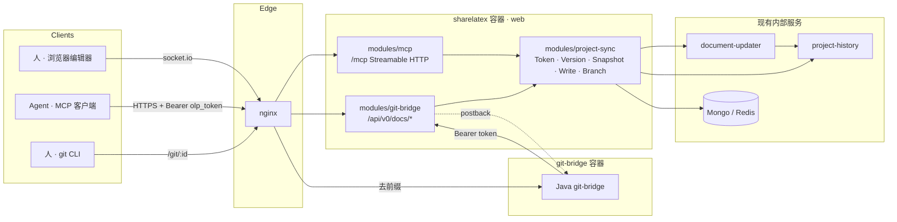

# Overleaf CE 内建 MCP 与 git-bridge 共存架构设计

- 基线：`overleaf/overleaf@28ad3b0`（fork：`Zack-Will/overleaf`）
- 状态：v1.2（2026-09-12，补入 UI / 环境 / 内部接口三份调研结论）
- 范围：在 Community Edition 上，不依赖 Server Pro 闭源模块，同时提供
  1. 面向 AI agent 的内建 MCP（Model Context Protocol）端点
  2. 与官方 Java git-bridge 完全兼容的 Git 集成

  两者共享同一套令牌、版本与写入内核，改动出现在同一条历史时间线上。

### v1.1 相对 v1 的变化

| 变化 | 原因 |
|---|---|
| 明确设计原则：agent 易用性第一，可回滚修改树，可建临时分支，优先原生接口 | 项目负责人反馈 |
| 项目标识统一为 URL 中的 24 位十六进制 id，工具同时接受完整 URL | 复制项目链接给 agent 即可定位 |
| 去掉 Redis 变更集，改为 `write_files` 一次原子写入 + 一个 label | 减少往返与状态管理 |
| 修改树 = 历史 label + 最小分支链接记录，不再新建节点集合 | 原生接口优先；历史面板天然可视化 label 并支持一键回退 |
| 里程碑重排：MCP 读写与分支先于 git-bridge 适配器 | agent 侧收益最大，git 侧已有外置桥过渡 |
| Web UI 可视化列为增量目标 | 先铺基础能力 |

### v1.2 相对 v1.1 的变化

| 变化 | 原因 |
|---|---|
| `revert_to` 不走 `RestoreManager`，改为"取历史快照 + `writeFiles`" | `RestoreManager` 依赖 `rangesSupportEnabled`，CE 项目默认关闭；且它删了重建实体，id 变化、事件风暴 |
| 快照服务必须解析 `{data:{hash}}` 条目 | project-history 只给"本 chunk 内改过的文本"内容，未改动的文本与二进制都只给 hash |
| 分支项目用自动标签 `branch: <父项目名>` 分组 | 项目列表没有任何模块扩展点，标签是零前端改动的方案 |
| agent 名字暂不进历史 origin，只显示 "(via Agent)" | `Origin.toRaw()` 只序列化 `kind`，要保留 `agent` 需改共享库 `overleaf-editor-core` |
| 明确 UI 接入路径与两处门控 | 设置页同步区块与编辑器 Integrations 标签在 CE 下默认隐藏 |
| 本地集成环境定为 `develop/` compose（跳过 clsi） | 见 `doc/design/dev-environment.md` |

---

## 1. 设计原则

1. **agent 易用性第一**。工具少而正交，参数显式，无会话隐式状态，错误可执行。
2. **每次 agent 写入都是可回滚的一个节点**。写入必带 message，落地即打 label，人在历史面板里能看见、能一键恢复。
3. **临时分支是一等能力**。agent 可以在不打扰主线的副本上工作，再以可审阅的方式合回。
4. **原生接口优先**。复用 Overleaf 已有的 handler、history label、RestoreManager、ProjectDuplicator，不引入新的抽象层与存储，除非原生能力确实缺失。
5. **可视化增量交付**。历史面板已能展示 label 与来源；专门的树视图、设置页 UI 后续再补。
6. **改动集中在 `services/web/modules/` 下**，upstream 升级时 rebase 成本最小。

### 项目标识约定

所有工具的 `project` 参数接受两种形式，服务端统一解析：

- 24 位十六进制 id：`68c1f9a3e4b0c2d1a5f6e7b8`
- 完整 URL：`https://overleaf.example.com/project/68c1f9a3e4b0c2d1a5f6e7b8`（允许带尾部路径或查询串）

所有返回项目的地方同时给出 `project_id` 与 `url`，agent 回复用户时可直接贴链接。

---

## 2. 现状：CE 里有什么、缺什么

行号以 `28ad3b0` 为准。

### 2.1 已存在、可直接复用

| 能力 | 位置 | 说明 |
|---|---|---|
| web 模块加载机制 | `services/web/app/src/infrastructure/Modules.mjs:43-91` | 按 `Settings.moduleImportSequence` 加载 `modules/<name>/index.mjs` |
| 无 CSRF 路由挂点 | `services/web/app/src/infrastructure/Server.mjs:231` | `applyNonCsrfRouter` 在 CSRF 之前执行，机器客户端端点走这里 |
| 项目级最新版本号 | project-history `GET /project/:id/version`（`services/project-history/app/js/Router.js:24`） | `{version, timestamp, v2Authors}` |
| 指定版本的全项目快照 | project-history `GET /project/:id/version/:version`（`Router.js:72`） | `SnapshotManager.js:115-116` 注释："Used by git bridge" |
| 历史 label | `HistoryManager.mjs` / project-history `Router.js:38-55` | 命名版本；前端历史面板可展示并"恢复到此版本" |
| 外部写入合并器 | `ThirdPartyDataStore/UpdateMerger.mjs:91` | `_mergeUpdate(userId, projectId, path, fsPath, source)`，注释 `// called by GitBridgeHandler` |
| 文档级设值 | `DocumentUpdaterHandler.mjs:117` `setDocument(...)` | document-updater 对新旧内容做 diff 生成 OT 操作，并发人工编辑不会被覆盖 |
| origin 透传到历史 | `project-history/app/js/UpdateTranslator.js:140-144` | `source` 传对象 `{kind:'git-bridge'}` 即成为 `change.origin`；前端 `origin.tsx:10` 已渲染 "(via Git)" |
| 项目复制 | `Project/ProjectDuplicator.mjs:37` | `duplicate(owner, projectId, name, tags, opts)` |
| 版本回退 | `History/RestoreManager.mjs`，路由 `HistoryRouter.mjs:82-92` | `revert_file` / `revert-project`，origin 为 `restore` 系列 |
| 权限判定 | `Authorization/AuthorizationManager.mjs:260-334` | `canUserReadProject` / `canUserWriteProjectContent`，不依赖 session |
| 项目锁 | `infrastructure/LockManager.mjs` | Redis 锁 |
| 前端挂点 | `settings.defaults.js:1029,1056,1101` | `overleafModuleImports.gitBridge / integrationLinkingWidgets / integrationPanelComponents` |
| 功能开关 | `Features.mjs:66-67` | `Settings.enableGitBridge`，CE 从未赋值 |
| Java git-bridge 源码与镜像 | `services/git-bridge/`，`quay.io/sharelatex/git-bridge` | MIT；`server-ce/test/docker-compose.yml:59-68` 展示接线 |

### 2.2 缺失、需要新建

| 缺口 | 影响 |
|---|---|
| 个人访问令牌模型、校验、管理接口 | 机器客户端无法按用户鉴权（**M1 已实现，见第 8 节**） |
| MCP 端点与工具 | 全仓库零引用 |
| 任何 compare-and-swap 写接口 | agent 写入没有基线校验 |
| 分支链接记录 | fork 出来的项目与父项目之间没有关系数据 |
| web 侧 `/api/v0/docs/*` 四个端点 | git-bridge 无法取版本、快照，无法推送 |
| `/oauth/token/info` | git-bridge 无法校验令牌（**M1 已实现**） |
| `enableGitBridge` 赋值、nginx `/git/` 路由、compose 服务 | git 功能开关永远关闭 |
| 编辑器 Git 模态框、设置页令牌 UI、修改树视图 | 可视化，增量交付 |

---

## 3. 总体架构



三个模块，一个依赖方向：

```
modules/project-sync   核心库 + 令牌 + 分支链接          （无外部依赖）
modules/mcp            MCP 适配器                        dependencies: ['project-sync']
modules/git-bridge     HTTP 适配器 + nginx/compose 接线    dependencies: ['project-sync']
```

### 3.1 共存的关键约束

1. **单一真相源**：读一律经 project-history 快照，写一律经 `UpdateMerger` / `setDocument` 进入 document-updater。
2. **统一版本坐标**：`project_version`（project-history 单调递增版本号）是唯一的项目级基线。git-bridge 的 `latestVerId` 就是它；MCP 写入的 `base_version` 也是它。
3. **来源可辨**：写入 `source` 传对象，`{kind:'git-bridge'}` 或 `{kind:'mcp', agent, message}`。历史面板显示 "(via Git)" / "(via Agent)"。
4. **互相可见**：git push 产生新版本，agent 下一次读到的 `project_version` 就变了；agent 写入的版本，`git pull` 作为新 commit 拉下来。
5. **同一把锁**：`project-sync` 对每个项目一个写锁，覆盖"应用改动 + 打 label"这一小段。

---

## 4. 核心模块 `modules/project-sync`

```
services/web/modules/project-sync/
├── index.mjs
├── app/src/
│   ├── models/PersonalAccessToken.mjs    # 已实现
│   ├── models/SyncBranch.mjs             # 分支链接记录（M3）
│   ├── TokenService.mjs                  # 已实现
│   ├── TokenAuthMiddleware.mjs           # 已实现：requireAccessToken(scope)
│   ├── ProjectSyncRouter.mjs             # 已实现：/oauth/token/info、令牌管理 REST
│   ├── ProjectRef.mjs                    # 解析 id / URL，权限检查
│   ├── VersionService.mjs                # flush + 取 project_version
│   ├── SnapshotService.mjs               # 指定版本快照、二进制签名 URL
│   ├── WriteService.mjs                  # write_files 原子写入 + label
│   ├── BranchService.mjs                 # fork / diff / merge / archive
│   └── Errors.mjs                        # 已实现
└── test/unit/src/
```

### 4.1 个人访问令牌（已实现）

`personalAccessTokens` 集合：`user_id`、`tokenPrefix`（前 8 位）、`hashedToken`（sha256，唯一）、`scopes`（`git_bridge` | `mcp`）、`label`、`createdAt`、`expiresAt`、`lastUsedAt`。令牌格式 `olp_` + 16 位字母数字。`requireAccessToken(scope)` 接受 `Bearer <token>` 或 `Basic git:<token>`，成功后 `req.syncUser = {userId, scopes, tokenId}`；失败返回 `401 {error_code: token_malformed|token_invalid|token_expired}` 或 `403 insufficient_scope`。实现了 `listPersonalAccessTokens` / `cleanupPersonalAccessTokens` 两个 hook。

### 4.2 项目引用与权限

```js
// ProjectRef.resolve('https://host/project/68c1…/…') → { projectId: '68c1…', url }
// ProjectRef.requireAccess(userId, projectId, 'read' | 'write')
//   → AuthorizationManager.promises.canUserReadProject / canUserWriteProjectContent
```

### 4.3 版本服务

```js
async function getLatestVersion(projectId) {
  await DocumentUpdaterHandler.promises.flushProjectToMongo(projectId)
  await HistoryManager.promises.flushProject(projectId)
  return projectHistory.get(`/project/${projectId}/version`)   // {version, timestamp}
}
```

机器客户端没有"重新编译"来触发 flush，所以读版本前必须自己 flush 两层。

### 4.4 快照服务

`getSnapshot(projectId, version)` → project-history `GET /project/:id/version/:version`，返回 `{files: {path: {data:{content}} | {data:{hash}}}}`。

注意 `SnapshotManager._loadFilesLimit`（`services/project-history/app/js/SnapshotManager.js:261-271`）只为"本 chunk 内有文本操作的可编辑文件"返回内容；**未改动的文本文件与二进制文件一律只给 hash**。因此快照服务必须：

- 对每个 `{data:{hash}}` 条目用 `HistoryManager.promises.requestBlobWithProjectId(projectId, hash)` 拉 blob（并发上限 4），用 `FileTypeManager` 判断文本还是二进制；文本超过 `Settings.max_doc_length`（2 MB）按二进制处理。
- 读取前先经 `VersionService.getLatestVersion` 触发 flush，否则"最新"快照落后于编辑器。
- hash 是内容的 git blob SHA-1，跨项目可比较；但 blob 存储按项目隔离，必须用"看到这个 hash 的那个项目"的 history id 去取，跨项目写入前要先 `HistoryManager.copyBlob`。

二进制对外经 web 提供 HMAC 签名的短时 URL（供 git-bridge 无鉴权头拉取，见 6.1）。对文件数与总字节设上限，超限返回 `413`。

### 4.5 写服务与修改树

**每次写入 = 锁内应用 + 一个 label。** label 的 comment 就是 agent 传入的 message，version 是写入后的 `project_version`。这样：

- 历史面板里每个 agent 写入都是一条命名版本，人一眼可见，且原生支持"恢复到此版本"。
- `list_history` 直接读 label 与 updates，不需要新的节点集合。
- 回滚 = `RestoreManager` 恢复到某个 label 的版本，origin 为 `project-restore`，本身又是一个新版本。线性历史下回滚是向前的，语义与 git revert 一致。

```js
async function writeFiles(projectId, userId, {baseVersion, message, agent, upserts, deletes}) {
  return LockManager.runWithLock(`sync:${projectId}`, async () => {
    const current = await getLatestVersion(projectId)
    if (baseVersion != null && current.version !== baseVersion)
      throw new VersionConflictError({expected: baseVersion, actual: current.version})
    const origin = {kind: 'mcp', agent, message}
    for (const {path, fsPath} of upserts)
      await UpdateMerger.promises._mergeUpdate(userId, projectId, path, fsPath, origin)
    for (const path of deletes)
      await UpdateMerger.promises.deleteUpdate(userId, projectId, path, origin)
    const after = await getLatestVersion(projectId)
    await LabelsService.create(projectId, userId, after.version, message)
    return {version: after.version, label}
  })
}
```

要点：

- `_mergeUpdate` 自动判 doc / file、自动建目录、自动广播实时事件，编辑器即时刷新。
- `setDocument` 在 document-updater 内做 diff 生成 OT 操作，锁外有人正在打字也不会被整段覆盖。`base_version` 校验解决的是"agent 基于过期内容做决策"的语义问题。
- `deleteUpdate` 目前吞错误只打 warn（`UpdateMerger.mjs:137-142`），封装层要显式收集失败并返回。
- 单文件写只是 `upserts` 长度为 1 的特例，不单独实现一套。

**回退（`revert_to`）不走 `RestoreManager`。** 原因有三：`revertProject` / `revertFile` 要求 `project.overleaf.history.rangesSupportEnabled`，而 CE 项目默认关闭（`ProjectCreationHandler.mjs:275-286`，split test 在非 SaaS 下恒为 default）；它们先删后建实体，实体 id 全部变化，socket 事件风暴；它们不打 label。我们的实现是"取目标版本快照（含 blob 解析）→ 构造 `writeFiles` 的 upsert 与 delete 列表 → 锁内应用 → label `Revert to version N`"，origin 为 `{kind:'mcp', agent, message, revert:{from,to}}`。这样回退本身也是修改树上的一个普通节点，实体 id 稳定，且不依赖任何功能开关。

**`edit_file` 走同一条路。** 从 document-updater 读实时内容，在服务端按 `replace_range` / `replace_anchor` / `replace_section` 算出新内容，预检 `Σ(line.length+1) ≤ Settings.max_doc_length`（否则 document-updater 返回 406），再交给 `writeFiles`。document-updater 的 `setDoc` 对新旧内容做 diff 生成 OT 操作，并发的人工输入不会被覆盖。

### 4.6 分支服务

Overleaf 的历史是单项目线性的，分支只能是**另一个项目**。原生的 `ProjectDuplicator.duplicate` 已经能复制全部内容，缺的只是"这个副本是谁的分支、基于哪个版本"这条关系。

`syncBranches` 集合（唯一新增的存储）：

```js
{ branchProjectId, parentProjectId, baseVersion, name, createdBy, createdAt,
  status: 'open' | 'merged' | 'archived', mergedVersion }
```

操作：

| 操作 | 实现 |
|---|---|
| `create_branch(project, name)` | `ProjectDuplicator.promises.duplicate(owner, id, "<原名> [branch: name]")`，记录 `baseVersion` = 父项目当前版本 |
| `list_branches(project)` | 查集合，附带每个分支的当前版本与 URL |
| `diff_branch(branch)` | 三方比较：父项目 `baseVersion` 快照、分支最新快照、父项目最新快照；输出每个文件的状态（仅分支改、仅主线改、双方改、冲突） |
| `merge_branch(branch, dry_run=true)` | 文本文件做三方合并（`diff3` 语义，用 `diff` 包或 `node-diff3`）；二进制以分支为准但双方都改则报冲突。`dry_run` 返回合并结果与冲突 hunk；确认后以 `writeFiles` 落到父项目，message 为 `merge branch <name>`，标记 `status: merged` |
| `archive_branch(branch)` | 项目归档（`ProjectDeleter.archiveProject`），状态置 `archived` |

冲突策略：**只返回冲突，不自动应用**。agent 拿到冲突 hunk 后在分支上解决再重新 merge，或让人在编辑器里处理。

分支项目会出现在用户项目列表里，名字带 `[branch: …]` 后缀。这是原生行为，也让人随时能打开分支看内容。

实现细节（来自内部接口调研）：

- `ProjectDuplicator.duplicate` 只需要 `owner._id`，用 `cloneHistory: false`（`true` 在 CE 里是坏的，blob 批量复制从未实现）。副本从空历史开始，所以 `baseVersion` 必须记父项目 fork 时的版本，不能从分支自身推导。
- 项目名上限 150 字符，禁止 `/`、`\` 和首尾空白，不要求唯一。拼后缀前先把父项目名截到 `150 - 后缀长度`，再过 `ProjectDetailsHandler.fixProjectName`。
- **分组用标签，不改前端。** 项目列表没有任何模块扩展点；fork 时经 `TagsHandler` 给分支项目挂标签 `branch: <父项目名>`，侧栏筛选和行内徽章天然可用。真正的嵌套视图需要改 5 个核心文件，列为 M5 的可选项。
- 归档走 `ProjectDeleter.promises.archiveProject(projectId, userId)`，只是按用户的可见性标记，项目仍可通过 URL 访问、历史保留。
- 三方合并用仓库已有的 `diff` 5.2.2（`services/web` 的直接依赖）的 `merge(mine, theirs, base)`，冲突 hunk 带 `conflict: true`。不引入 `node-diff3`。
- 跨项目写入二进制前必须 `HistoryManager.copyBlob(sourceHistoryId, targetHistoryId, hash)`，blob 存储按项目隔离。
- 新集合 `syncBranches` 需要一份 `tools/migrations/` 迁移创建索引（`autoIndex` 关闭，schema 上的 `index: true` 不会生效），tags 用 `['server-ce','server-pro','saas']`。

---

## 5. 适配器 `modules/mcp`

### 5.1 传输与鉴权

- `POST/GET/DELETE /mcp`，Streamable HTTP，`@modelcontextprotocol/sdk` 的 `StreamableHTTPServerTransport`，经 `nonCsrfRouter` 挂到 `publicApiRouter`。
- `requireAccessToken('mcp')`。Claude Code：`claude mcp add --transport http <url> --header "Authorization: Bearer olp_…"`；仅支持 OAuth 的客户端经 `mcp-remote`。
- **无状态**：每个请求独立，不用 session，不发 cursor；状态由 `project_version` 与显式参数表达。

### 5.2 工具面

所有工具 `project` 参数接受 id 或 URL。所有读返回 `project_version`；所有写要求 `message`，返回新的 `project_version` 与 label。

| 工具 | 输入 | 输出 / 语义 |
|---|---|---|
| `list_projects` | | 可读项目：`project_id`、`url`、`name`、`permissions: read|write` |
| `get_project` | `project` | 文件树、根文档、`project_version`、`permissions`、分支信息 |
| `read_file` | `project`, `path`, `range?` | 内容、`sha256`、`project_version`；大文件按行范围分片 |
| `get_outline` | `project`, `path?` | LaTeX 章节结构，服务端解析 |
| `search` | `project`, `query`, `regex?` | 命中列表，含行号与上下文 |
| `write_files` | `project`, `base_version?`, `message`, `files[]`（`{path, content | content_base64 | delete:true}`） | 原子写入 + label。`base_version` 不符 → `conflict`，附当前版本与相关文件的 diff |
| `edit_file` | `project`, `path`, `base_version`, `edits[]`, `message` | `edits` 支持 `replace_range` / `replace_anchor`（文本锚点）/ `replace_section`（按标题）。服务端算出新内容后走 `write_files` |
| `list_history` | `project`, `limit?`, `before?` | label 列表 + updates，含 origin 与作者 |
| `diff` | `project`, `from_version`, `to_version`, `path?` | project-history diff |
| `revert_to` | `project`, `version`, `path?`, `message` | `RestoreManager`，返回新版本 |
| `create_branch` / `list_branches` / `diff_branch` / `merge_branch` / `archive_branch` | 见 4.6 | |

返回同时提供 `content`（人类可读文本）与 `structuredContent`（机器字段）。错误统一为 `{code, message, expected_version?, actual_version?, next_action}`：

```json
{
  "code": "version_conflict",
  "expected_version": 41,
  "actual_version": 42,
  "diff_since_expected": {"main.tex": "@@ -10,3 +10,4 @@ ..."},
  "next_action": "re-read the listed files, re-apply your change, retry with base_version=42"
}
```

### 5.3 归属与可见性

- origin `{kind:'mcp', agent:'<MCP client name>', message}`。
- 前端 `origin.tsx` 增加 `mcp` → "(via Agent)"；`editor-manager-context.tsx:238` 的 `source === 'git-bridge'` 判断扩展为包含 `mcp`。词条 `history_entry_origin_agent` 加进 `locales/en.json` 后需 `npm run extract-translations`。
- **agent 名字暂不进历史。** `libraries/overleaf-editor-core/lib/origin/index.js` 的 `Origin.toRaw()` 只序列化 `kind`，`origin.agent` 写入 history-v1 时会被丢弃。要显示具体 agent 名需新增 `McpOrigin` 子类并在共享库注册，影响 history-v1 与 project-history。agent 名已写在 label 的 message 里，M5 再评估是否值得动共享库。
- project-history 的 `SummarizedUpdatesManager` 会在 `origin.kind` 变化处切分条目，所以 agent 改动天然与人工编辑分开显示。

### 5.4 UI 接入路径（M5）

前端调研结论，供 M5 直接执行：

| 目标 | 机制 | 必须的核心改动 |
|---|---|---|
| 设置页令牌管理 | 组件放 `modules/project-sync/frontend/js/components/`，登记到 `settings.defaults.js` 的 `overleafModuleImports.integrationLinkingWidgets` | 该区块以 `isSaas \|\| gitBridgeEnabled` 为显示条件（`linking-section.tsx:45`）；M4 设置 `enableGitBridge` 后自然打开，或改用新槽位 + `PatSection` |
| 编辑器 "Connect agent / Git" 面板 | `integrationPanelComponents` 槽位 + `integration-card.tsx` 复用，模态框用 `OLModal` 系列 | Integrations 标签以同一条件隐藏（`rail.tsx:122`） |
| 历史面板 "(via Agent)" | 三处追加式改动 | `shared.ts` 类型联合、`origin.tsx`、`en.json` |
| 项目列表分支分组 | 自动标签 | 无 |

约束：槽位登记永远是核心文件改动，模块不能自注册；槽位组件不接收 props，数据靠 `getMeta()` 或自行 fetch（`fetch-json.ts` 自动带 CSRF）；模块 pug 不能新增 `ol-*` meta（`Views.mjs:78-88` 启动即抛错）。mocha、Cypress、Storybook 都已自动收录 `modules/*`，不需要新建测试配置。现成可复用的 8 条 `git_bridge_modal_*` 词条是闭源模块遗留，无消费者。

---

## 6. 适配器 `modules/git-bridge`

契约细节来自 Java 源码，与 v1 相同，此处保留要点。

### 6.1 HTTP 契约

全部经 `nonCsrfRouter` 挂到 `publicApiRouter`，鉴权 `requireAccessToken('git_bridge')`：

| 端点 | 行为 | 依据 |
|---|---|---|
| `GET /oauth/token/info` | 有效 `200 {}`；过期 `401 {"error_code":"token_expired"}` | `Oauth2Filter.java:283-299`（已实现） |
| `GET /api/v0/docs/:id` | 无读权限 `403`；否则 `{latestVerId, latestVerAt, latestVerBy}`，空项目 `0` | `GetDocResult.java:68-105` |
| `GET /api/v0/docs/:id/saved_vers` | labels → `[{versionId, comment, user, createdAt}]` | `GetSavedVersResult.java:48-54` |
| `GET /api/v0/docs/:id/snapshots/:v` | `{srcs:[[content,path]], atts:[[signedUrl,path]]}` | `SnapshotData.java:52-56` |
| `POST /api/v0/docs/:id/snapshots` | 无写权限 `403`；版本不符 **HTTP 200** `{code:"outOfDate"}`；否则 `200 {code:"accepted"}` + 异步应用 | `Request.java:74-133`：非 2xx 都会被当成别的异常 |
| `GET /api/v0/docs/:id/blobs/:hash?token=&_path=` | HMAC 校验后流式返回 | git-bridge 取附件不带鉴权头 |

推送应用：下载 `files[].url`（`http://git-bridge:8000/api/<pid>/<uuid>?key=…`），删除 = 当前路径集减去 `files[].name`，经 `WriteService.writeFiles` 落地（origin `git-bridge`，message 取自 git commit），360 秒内 POST postback `{code:"upToDate", latestVerId}`。

### 6.2 接线

- `server-ce/config/settings.js`：`enableGitBridge = GIT_BRIDGE_ENABLED === 'true'`，`gitBridgePublicBaseUrl = siteUrl + '/git'`，`apis.gitBridge.url`。
- nginx：`location /git/ { proxy_pass http://git-bridge:8000/; }`（去前缀，`Oauth2Filter` 期望路径直接是 `/<projectId>`）。
- compose：照抄 `server-ce/test/docker-compose.yml:59-68`。
- 项目删除时通知 `DELETE /api/projects/:id`。
- `git-bridge.spec.ts:450-457` 断言"CE 设了变量也不能启用"，fork 里反转这一条。

---

## 7. 数据流示例

### 7.1 agent 写入与 git push 交错

```
t0  project_version = 10
t1  agent: read_file main.tex                      → project_version 10
t2  人:   git push（latestVerId 10）                → accepted，应用中
t3  agent: write_files base_version=10             → 取锁等待 → 版本已是 11 → conflict，附 diff
t4  agent: 基于 diff 重做 → base_version=11        → 成功，version 12，label "tighten intro"
t5  人:   历史面板看到 v11 (via Git)、v12 (via Agent, label)，可一键恢复到 v11
t6  人:   git pull → 两次 commit
```

### 7.2 分支

```
agent: create_branch P "exp-figures"   → 分支项目 D，baseVersion 12，URL 可直接给人
agent: 在 D 上多次 write_files，每次一个 label
agent: diff_branch D                   → 文件级状态 + 冲突预告
agent: merge_branch D dry_run=true     → 合并结果与冲突 hunk
人 / agent: 确认 → merge_branch D dry_run=false → P 上一个 label "merge branch exp-figures"
agent: archive_branch D
```

---

## 8. 实施里程碑

| 阶段 | 交付 | 状态 |
|---|---|---|
| **M1 令牌与鉴权** | PAT 模型与服务、`requireAccessToken`、`/oauth/token/info`、令牌管理 REST、单元测试 | ✅ 分支 `feat/project-sync-tokens`，13 提交，Vitest 16/16、eslint 通过 |
| **M2a MCP 读 + `write_files`** | `ProjectRef`、`VersionService`、`SnapshotService`、`LabelService`、`WriteService`、MCP 传输、7 个读工具 + `write_files`、smoke 脚本、`AGENTS.md` | ✅ 分支 `feat/mcp-read`，26 提交，Vitest 26/26、eslint、prettier、smoke 全过 |
| **M2b `edit_file` / `revert_to` / 前端标签** | 快照 blob 解析、`RevertService`、`edit_file` 三种定位、"(via Agent)" 三处改动、`services/web/.prettierrc`、MCP 结果对象化 | ✅ `feat/mcp-write-revert`，实机验证：写入 → 冲突 → 编辑 → 回退 |
| **M2.5 本地集成环境** | `develop/` compose，跳过 clsi | ✅ 运行中，实测修正见 `dev-environment.md` |
| **M3 分支** | `SyncBranch` 模型 + 迁移、`BranchService`、五个分支工具、`diff.merge` + `applyPatch` 三方合并、自动标签 | ✅ `feat/branches`，实机验证：不相交合并成功、同行冲突报 hunk、归档 |
| **M4 git-bridge 适配器** | 四个端点、签名 blob URL、推送与 postback、settings / nginx / compose / webpack 代理、`projectExpired` 删除通知 | ✅ `feat/git-bridge`（Opus），实机验证：官方容器 `git clone` / `push`，历史 origin `git-bridge` |
| **集成** | `feat/agent-sync` = M3 + M4 + 设计文档，93 个单元测试 | ✅ 本地，未推送 |
| **M5 可视化** | 设置页令牌区块、编辑器 Git & agents 卡片与模态框、历史面板来源后缀（"You (via Claude Code)"，`McpOrigin` 让 agent 名进历史）、Storybook 固件 | ✅ `feat/ui`（Opus），已合入；浏览器验收待做 |
| **R1 评论面板** | 模块 `review`：`REVIEW_PANEL_ENABLED`、11 条路由、实时事件、新项目默认 `rangesSupportEnabled` | ✅ codex，已合入，`joinProject` 返回 `trackChangesVisible: true` |
| **R2 MCP 评论工具** | `ReviewService`、Agent 服务用户、`list_comments` / `get_review_queue` / `reply_comment` / `resolve_comment` / `reopen_comment`、`comments_affected` | ✅ Opus，已合入，136 个单元测试；实机待验 |
| **R3 新增评论与重锚** | document-updater `POST …/comment` 端点、`add_comment` / `reanchor_comment`、写入后自动重锚 | ✅ Opus，已合入，165 个 web 单元测试 + 521 个 document-updater 测试；实机：agent 用 `add_comment` 建评论，`edit_file` 改写被评论句子后评论跟随新文本（`shrunk`，未游离） |
| **R4 修订建议** | agent 以 `meta.tc` 提交，人接受/拒绝 | ⏳ |
| **M6 加固** | 速率限制、大项目上限、指标、最小 OAuth（如有客户端需要） | |

M2 完成即可端到端使用：拿令牌、把项目链接贴给 agent、agent 读写并留下可回滚的 label。

---

## 9. 风险与对策

| 风险 | 对策 |
|---|---|
| upstream 每月发版，内部函数签名变化 | 核心只依赖少数内部函数，集中在 `project-sync` 内；CI 跑单元与 acceptance 测试 |
| 大项目快照内存 | 文件数 / 字节上限；MCP 读取始终分片 |
| 三方合并对 LaTeX 的语义盲区 | 只做行级合并并如实报冲突；不自动解决 |
| 分支项目污染项目列表 | 命名约定 + 后续 UI 折叠；`archive_branch` 及时归档 |
| 令牌泄露即项目读写权 | scope、过期、可撤销；所有写入带 origin 与 label 可审计 |
| CE 无 OAuth 服务器，部分 MCP 客户端连不上 | 先 Bearer；M6 视需要做最小 OAuth 2.1 |
| AGPL 义务 | fork 公开 |

---

## 10. 评论协作（模块 `review`）

目标：复现"人在正文上留评论 → agent 逐条处理并回复 → 人复核"的工作流，且评论不随内容修改丢失。

### 10.1 事实基础（调研自源码）

- 评论是挂在字符范围上的 `ranges.comments[] = { id, op: { c: 原文, p: 偏移, t: 线程 id }, metadata }`，由 `@overleaf/ranges-tracker` 随每个编辑操作做 OT 变换：范围前插入整体后移，范围内插入伸长，与范围重叠的删除收缩。**被评论文本被整段删除时评论不消失**，退化为游离态（`c: ''`），线程与消息完好，面板仍显示。
- 用同一 `t` 再提交一次评论 op 即为"移动"（`RangesTracker.addComment`），这是重新锚定的原语。
- 我们的 `edit_file` 经 document-updater `setDoc` 做 diff 生成最小操作，评论随之伸缩而非游离。
- 线程内容与解决状态只存在 chat 服务（`rooms` + messages）；document-updater 的 resolve/reopen 端点仅在 `rangesSupportEnabled` 时镜像到 history。
- CE 缺的只有胶水：`ProjectEditorHandler.trackChangesAvailable: false` 一行常量隐藏了整个 review panel；`track-changes` 闭源模块不存在；11 条线程/范围 web 路由未注册（`GET /project/:id/threads`、`/ranges`、`thread/:t/messages`、`resolve`、`reopen`、`DELETE thread`、消息编辑删除、`changes/accept`、`track_changes`）。chat、document-updater 范围管理、docstore 持久化、31 个组件的 review panel 前端全部在开源树中。
- 服务端没有"新增评论范围"的 HTTP 路径（编辑器经 websocket 提交 op）；document-updater 已有 resolve/reopen/delete comment 端点，缺 add。

### 10.2 决策

1. **在 document-updater 新增 `POST /project/:p/doc/:d/comment`**（约 60 行），复用 `setDoc` 的"构造 update → `UpdateManager.applyUpdate`"路径，自动广播给在线编辑器。不用无头 socket 客户端。
2. **agent 以独立服务用户身份发言**：模块设置 `review.agentUser`（邮箱与显示名），首次对某项目使用时由令牌所属用户（需为 owner）把该用户加为读写协作者；评论、回复、解决记录在该用户名下，面板一眼可辨。
3. **修订建议（tracked changes）放到 R4**：数据面全在（`meta.tc`、accept/reject 端点），但需补路由、开关与 `review` 权限，等评论闭环稳定后做。
4. **新建项目默认 `rangesSupportEnabled`**：否则回滚版本时评论不随之恢复。通过 `Settings.splitTestOverrides['history-ranges-support'] = 'enabled'` 在 fork 的 CE 设置里打开；现有项目不动。

### 10.3 工具面（MCP）

| 工具 | 说明 |
|---|---|
| `list_comments(project, path?, include_resolved?)` | 每条含 `thread_id`、被评论原文、文件与行列、`detached`、消息列表与作者、解决状态 |
| `get_review_queue(project)` | 未解决评论按文件分组，附前后各 3 行上下文，agent 一轮处理的入口 |
| `reply_comment(project, thread_id, content)` | 只写 chat |
| `resolve_comment` / `reopen_comment` | 写 chat；项目开了 `rangesSupportEnabled` 再镜像 document-updater |
| `add_comment(project, path, anchor, content)` | `anchor` 为首尾片段加省略号（Notion 式）或行范围，服务端换算精确范围，原文必须逐字匹配 |
| `reanchor_comment(project, thread_id, path, anchor)` | 把游离或漂移的评论移到新文本 |
| `suggest_edits(project, path, base_version, edits, message, agent?, act_as_agent?)` | `edits` 与锚点语义同 `edit_file`，但结果作为 tracked changes 落盘，等人接受或拒绝；返回 `{ project_version, label, change_ids, suggestions: [{change_id, type, line, text}], diff }` |
| `list_suggestions(project, path?)` | 待处理的修订建议按文件分组，每条含 `change_id`、`insert`/`delete`、原文、行列与作者 |
| `accept_suggestions(project, path, change_ids \| all)` / `reject_suggestions(...)` | 需写权限；以令牌用户（而非 agent 服务用户）身份落定——这是人的决定，工具只是让 agent 能按明确指令代劳——返回该文件剩余条数 |

`get_review_queue` 的摘要另附 `pending_suggestions`（取自它已经读过的 ranges，不额外多读一遍文档），
让 agent 知道上一轮建议人还没处理。

`edit_file` / `write_files` 返回增加 `comments_affected: [{thread_id, path, state: 'shrunk'|'grown'|'detached'|'moved'}]`；若 `replace_anchor` / `replace_section` 覆盖了某评论范围，写入后自动把该评论重新锚到替换后的文本。一轮评论处理对应一个 label，message 引用处理的线程 id。

### 10.4 分期

| 阶段 | 内容 |
|---|---|
| **R1** | 模块 `review`：`enableReviewPanel` 设置并覆盖 `trackChangesAvailable`；注册 11 条路由为 `ChatApiHandler` / `DocumentUpdaterHandler` 的薄代理，权限沿用上游（只读协作者可评论，匿名不可，token 用户不可）；写操作后经 `EditorRealTimeController` 广播 `new-comment` / `resolve-thread` / `reopen-thread` / `delete-thread`；`rangesSupportEnabled` 默认开。验收：浏览器里能选中文字加评论、回复、解决 |
| **R2** | MCP 读、回复、解决、评论队列；服务用户机制；`comments_affected` |
| **R3** | document-updater add-comment 端点；`add_comment` / `reanchor_comment`；写入后自动重锚 |
| **R4** | 修订建议：document-updater `setDoc` 增加 `track_changes` 开关；`SuggestionService`；MCP `suggest_edits` / `list_suggestions` / `accept_suggestions` / `reject_suggestions` |

**R4 落地：tracked `setDoc` 契约。** `POST /project/:project_id/doc/:doc_id`（document-updater）的请求体
多认一个可选字段 `track_changes: true`。置位时 `DocumentManager.setDoc` 给它构造的 update 挂上
`meta.tc = RangesTracker.generateIdSeed()`——这正是编辑器开着"修订模式"打字时 websocket 路径所带的字段，
`RangesManager.applyUpdate` 读到它就为这一条 update 打开 `track_changes` 并用它作为新建 change 的 id 种子——
于是 diff 出来的操作变成待处理的 tracked changes 而不是直接落盘的编辑。响应在原有字段之外增加
`change_ids: []`，即这次调用产生的 change id；history-ot 文档没有 ranges，按 R3 的做法回
`422 { code: 'ot_type_unsupported' }`。`change_ids` 是从更新后的 ranges 里读回来的，不是从我们发出去的
op 推出来的：update 会与排队中的更新做 OT 变换。判定规则是「id 以本次 idSeed 开头」（新建的 change，
`RangesTracker.newId()` 就是 idSeed 加计数），外加「同一用户的既有 change 文本发生了变化」（相邻编辑被
并入旧 change，id 不变）。位置不能用作判据（这次编辑之后的每条 change 都会整体后移），时间戳也不能
（合并时 `pickTimestamp` 留的是**较早**的那个）。

web 侧 `SuggestionService`（模块 `review`）在此之上：`suggestDocContent` 借用
`WriteService.withProjectWriteLock`，与普通写入同一把 `project-sync` 锁、同一套 `base_version` 校验，
成功后打一条 `Suggest: <message>` 的 history label（没产生任何建议就不打）；`listSuggestions` 从实时
ranges 读回，与人在 review panel 里看到的一致；`acceptSuggestions` / `rejectSuggestions` 走
`DocumentUpdaterHandler.acceptChanges` / `rejectChanges`，并拒绝不在待处理列表里的 id。

### 10.5 add-comment 端点契约（R3 落地）

`POST /project/:project_id/doc/:doc_id/comment`（document-updater，内部服务，无鉴权层）

请求体 `{ user_id, thread_id, position, text }`：`thread_id` 为 24 位十六进制；`position` 是
`lines.join('\n')` 上的 0 基字符偏移；`text` 必须与该位置的文档原文逐字相同。

- `200 { comment: { id, op: { c, p, t }, metadata }, version }` —— `comment` 从应用后的 ranges 读回，
  因此带的是 OT 变换之后的真实位置。`thread_id` 已存在时是「移动」，即重锚原语。
- `400 { code: 'invalid_request', message }` —— 参数不合法。
- `400 { code: 'text_mismatch', message, position, actual_text }` —— 文档已变，`actual_text` 是该位置
  现在的内容，调用方据此重试。
- `422 { code: 'ot_type_unsupported', message }` —— history-ot 文档，R3 只支持 sharejs 文档。
- `404` —— 文档不存在（沿用 document-updater 的统一错误处理）。

实现走 `UpdateManager.lockUpdatesAndDo` → `applyUpdate`，与 `setDoc` 同一条路径，因此会与排队中的
更新做 OT 变换，并经 `RealTimeRedisManager` 广播给在线编辑器。

## 11. 决策记录

1. **不复用 `TpdsController` 私有 API**：共享密钥鉴权、无用户归属。
2. **CAS 粒度用项目版本**：写入锁内校验，简单且与 git 一致；文档级版本不再单独暴露。
3. **去掉变更集**：`write_files` 数组即事务。
4. **修改树用 label 表达，不新建节点集合**：原生、可视、可恢复。
5. **分支 = fork 项目 + 一条链接记录**：唯一新增存储。
6. **冲突只报不合**。
7. **不实现 OAuth2 授权服务器**：git-bridge 的 `Oauth2Filter` 实际只做 bearer 校验。
8. **模块三分**：便于按需启用与向 upstream 贡献。
9. **回退用自有原语而非 `RestoreManager`**：绕开 `rangesSupportEnabled` 开关，保持实体 id 稳定，回退也成为带 label 的普通节点。
10. **分支分组用标签**：项目列表无扩展点，标签零改动；嵌套视图列为 M5 可选。
11. **agent 名字不进 origin**：避免为显示名改共享库 `overleaf-editor-core`；名字留在 label message 里。
12. **三方合并用 `diff` 5.2.2 的 `merge`**：已是 web 直接依赖，不新增包。
13. **集成环境用 `develop/` compose 且首期跳过 clsi**：MCP 与 git 验证不需要编译 PDF，省掉 texlive 的 1 到 2 小时构建。
